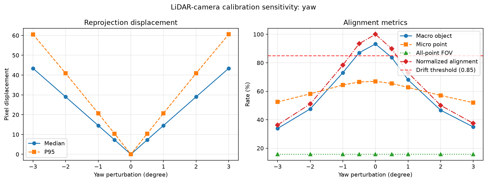
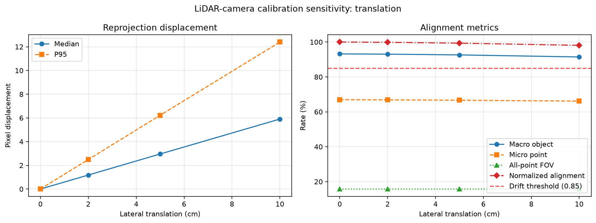
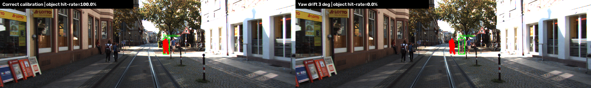
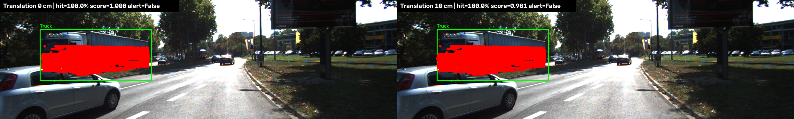

# Báo cáo Day 6: Đánh giá độ nhạy calibration LiDAR–camera

- **Họ tên:** Nguyễn Thị Thùy Dương
- **MSSV:** 2A202602905
- **Lớp:** AI20K – Track 4
- **Link repo:** https://github.com/ntthduong/NguyenThiThuyDuong-2A202602905-Track4-Day21
- **Topic:** A — LiDAR-camera projection QA
- **Dataset:** `data/synthetic`, `data/kitti_mini`
- **Các frame đã dùng:** toàn bộ 20 frame KITTI mini; minh họa: `000004`, `000011`, `000016`, `000019`, `000043`

## 1. Claim

Trên 20 frame KITTI, lệch extrinsic yaw `|1°|` làm trung vị điểm chiếu dịch khoảng 14.54 px,
làm macro object hit-rate giảm ít nhất 20 điểm phần trăm và khiến normalized alignment score xuống
dưới ngưỡng cảnh báo 0.85. Pixel displacement và object hit-rate vì vậy nhạy hơn tỷ lệ điểm trong FOV.

## 2. Evidence

Thí nghiệm giữ nguyên 20 frame, 111 object và chỉ đổi một yếu tố mỗi sweep. Không có phép ngẫu nhiên;
chạy lại tạo CSV cùng SHA256. Chi tiết nằm trong `results/yaw_perturb_sweep.csv`,
`results/translation_sweep.csv` và `results/object_metrics.csv`.

| Yaw | Median shift | P95 shift | Macro hit-rate | Alignment score | Cảnh báo |
|---:|---:|---:|---:|---:|:---:|
| 0° | 0.00 px | 0.00 px | 93.21% | 1.000 | Không |
| +0.5° | 7.28 px | 10.41 px | 83.73% | 0.898 | Không |
| +1° | 14.54 px | 20.70 px | 68.08% | 0.730 | Có |
| +2° | 29.01 px | 40.87 px | 46.70% | 0.501 | Có |
| +3° | 43.39 px | 60.56 px | 34.93% | 0.375 | Có |



Ba baseline ở khoảng cách [gần](../results/figures/demo_near_000019.png),
[trung bình](../results/figures/demo_medium_000011.png) và [xa](../results/figures/demo_far_000004.png).
Yaw nhạy hơn translation: dịch ngang 10 cm gây median shift 5.91 px nhưng score vẫn là 0.981.



## 3. Failure case



**Geometry:** pedestrian số 2 ở frame `000043`, cách 20.65 m và có 85 điểm, giảm từ 100% hit-rate
ở yaw 0° xuống 0% ở yaw +3°. Extrinsic sai đã đưa cùng điểm LiDAR sang sai pixel, trong khi FOV
vẫn khoảng 15.74–15.76%, nên FOV một mình không phát hiện được lỗi alignment.



**Metric:** dịch ngang 10 cm tạo median/P95 shift 5.91/12.40 px, nhưng macro alignment score vẫn
là 0.981 > 0.85 nên không cảnh báo; truck ở frame `000016` vẫn đạt hit-rate 100% vì box lớn.
Do đó cần kết hợp score với pixel/edge displacement, thay vì phụ thuộc vào một ngưỡng duy nhất.

## 4. Khuyến nghị nếu triển khai thật

Object hit-rate ở đây là metric **offline** vì cần ground-truth 3D/2D box. Trên ADAS online, có thể
thay bằng độ khớp LiDAR depth edge–image edge, lane boundary, segmentation hoặc calibration target.
Nên chia score theo khoảng cách, dùng cửa sổ 5–10 frame và hysteresis để giảm false alarm. Cần log
score, median/P95 shift, FOV, số feature hợp lệ, lệch timestamp, nhiệt độ/rung và phiên bản calibration.
Có thể lấy mẫu point cloud hoặc chạy QA tần suất thấp để giảm latency và tài nguyên tính toán.

## 5. Cách chạy lại

Chạy từ thư mục gốc; lệnh benchmark tái tạo toàn bộ CSV và ảnh trong `results/`.

```bash
python -m pip install -r requirements.txt
python -m src.topic_a_experiment --help
python -m starter.projection --data-root data/synthetic --frame 000000
python -m src.topic_a_experiment --data-root data/kitti_mini --out-dir results --alignment-threshold 0.85
python tools/check_submission.py
```

Tự kiểm hình học: điểm synthetic `(10, 0, 0)` cho `z_cam = 9.727` và pixel `(613.96, 175.01)`.

## 6. Khai báo sử dụng AI

| Công cụ | Dùng cho việc gì | Bạn đã kiểm chứng thế nào |
|---|---|---|
| OpenCode – GPT-5.6 Sol | Lập kế hoạch; hỗ trợ projection, metric, alignment threshold, CLI, biểu đồ và rà báo cáo | Test điểm `(10,0,0)` và dữ liệu lỗi; xem overlay; chạy benchmark thật trên 20 frame hai lần; đối chiếu CSV, ảnh và `check_submission.py` |

Tôi chịu trách nhiệm về code, ngưỡng và số liệu, đồng thời đã kiểm tra kết quả được tạo từ lệnh trên.
